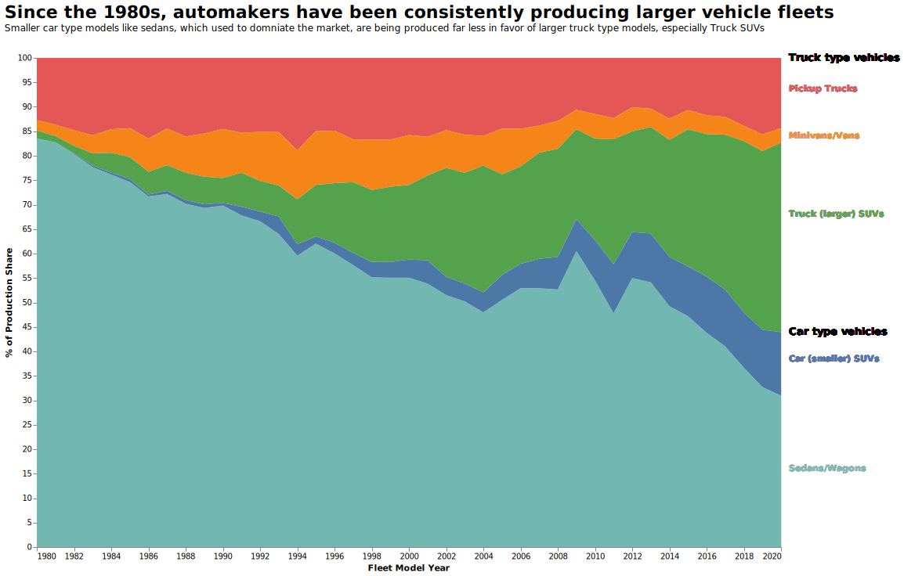

# CS 625 Project
Caleb Bradford  
Due December 11, 2023  

In this project, I was tasked with utilizing data journalism and storytelling techniques to implement an explanatory visualization that revealed something interesting.  

## My chosen topic  
The topic I chose to investigate was the phenomenon that recently came to be known as car bloat. This is basically the trend of everyday passenger vehicles in America getting larger and heavier over time. This trend has more to do with the types of vehicles being produced, with larger vehicle types becoming more prevalent over smaller vehicle types. I became especially curious about this after finding out that Ford would not be producing and selling any traditional sedans in America for the 2023 model year. This prompted me to look into this phenomenon further through data visualization.  

## Final question  
The final question that I ultimately wanted to address through my visualization was, "When automakers begin to trend towards producing larger vehicle types?" I specifically wanted to address when this trend began. While I have only noticed media coverage of car bloat in the past year, I wanted to see how long it had really been going on.  

## Chosen dataset  
In my research for this project, I found the perfect dataset to investigate vehicle production trends over time. The United States Environmental Protection Agency (EPA) has kept an automotive trends database for every model year since 1975. This includes various statistics about each model year fleet by vehicle type, including average weights, average fuel economy, and average carbon emissions. The vehicle types the dataset differentiated by are shown below, in order of size from biggest to smallest.  
1. Pickups
2. Minivans/vans
3. Truck SUVs
4. Car SUVs
5. Sedans/wagons  

The first 3 types above are considered to be truck type vehicles and the last 2 are considered to be car type vehicles.  
One key statistic from this dataset I was interested in was the production share each of the 5 vehicle types had for a given model year. By examining and visualizing this statistic, I could analyze how automakers have prioritized production of different vehicle types over the years. In doing so, I could easily show if they have recently been producing more larger truck type vehicles over car type vehicles. Showing this directly answers my final question.  
The data is available [here](https://www.epa.gov/automotive-trends/about-automotive-trends-data).

## My final chart  
Below is my final visualization created with Vega-Lite. The Observable notebook I worked in is available [here](https://observablehq.com/d/2edf35165bf70ffd). The JSON specification of the chart is available [here](finalchart.json) 

  

## Idiom/mark/data/encode table  
Idiom: Stacked area chart / Mark: area
| Data: Attribute | Data: Attribute Type  | Encode: Channel | 
| --- |---| --- |
| Model year | value, ordinal | horizonal position on a common scale (x-axis) |
| % of production share | value, quantitative | vertical spatial region (y-axis) |  
| Vehicle type | key, categorical | Hue |  

## Elaboration of final chart and headline  
My final chart answers my final question by showing the downward trend of the sedan vehicle class in favor of larger vehicle models like SUVs. Production of smaller vehicles like sedans has been on a steady downtrend since 1980 all the way to 2020, when production of car type vehicles is at an all time low. This is noted in my headline title. My subtitle also notes that the particular larger vehicle type that has seen an immense increase in popularity is truck SUVs, which had the highest portion of the production share in 2020.  

## Final thoughts  
I would say that the process of developing my final chart took about 10 hours over a couple of weeks. The process of getting a working visualization was probably the easiest part, since the production share statistic was well defined to the point where I did not have to make much changes to the data to get the stacked area chart to work. What did take more time and effort to do was the customizations that I felt would make the chart easier to understand. This included getting the vehicle type areas organized from smallest to biggest vehicle from the bottom to the top of the graph. Doing so required performing a convoluted calculate transform to fully customize the order the stacks appeared in. Another aspect that took a lot of effort was adding the text marks for the area labels as opposed to just using the automatically generated legend. I did this because I think it was easier to draw the relation between the area marks and the vehicle types they represented when the labels appeared right next to the marks.  

## References  
Ordering of stacks in area (https://vega.github.io/vega-lite/docs/stack.html#order)  
Space out title from chart (https://stackoverflow.com/questions/55128946/spacing-around-visualizations-in-vega-lite)  
ChatGPT conversation about adding arbitrary annotations outside of the chart (https://chat.openai.com/share/39e668d6-db6b-476e-aa9e-16889d6e1bc9)  